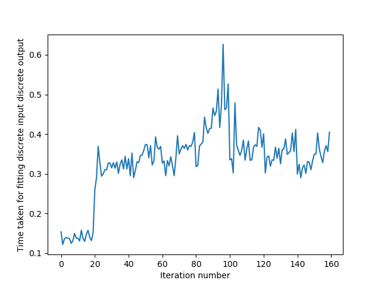
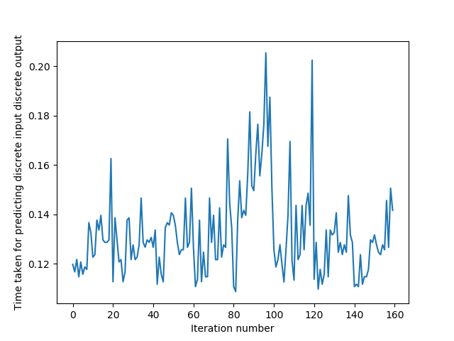
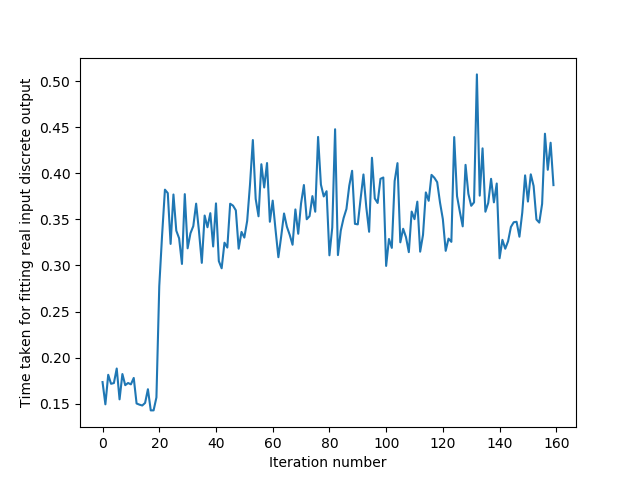
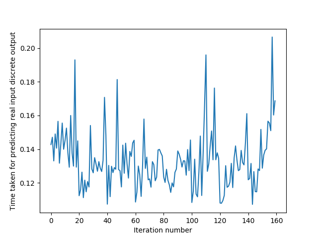
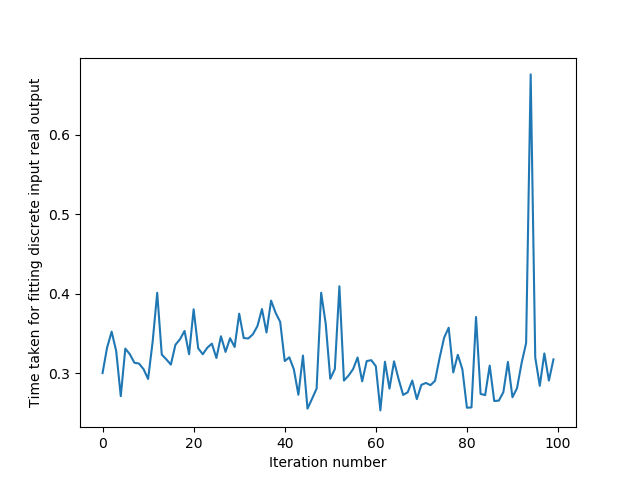
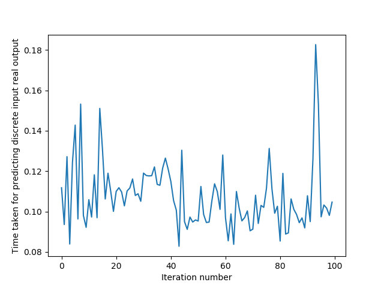
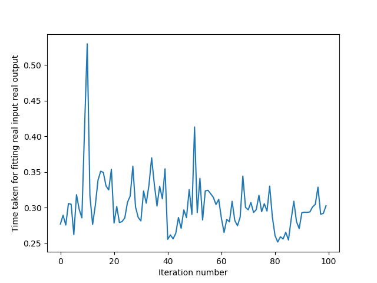
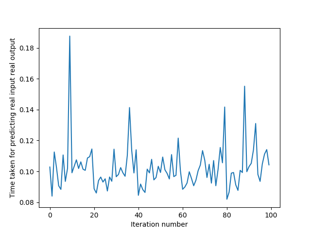

# ES654-2020 Assignment 1

*Harshil Jain* - *17110060*

------
Q.1. 

> The code can be checked by running usage.py

Q.2. 

> The accuracy of 30% test dataset is : 82.22222222222221

The precision with respect to class 0 (iris-setosa) is : 1
The precision with respect to class 1 (iris-versicolor) is : 1
The precision with respect to class 2 (iris-virginica) is : 0.8222222222222222
The precision with respect to class 0 (iris-setosa) is : 0.0
The precision with respect to class 1 (iris-versicolor) is : 1
The precision with respect to class 2 (iris-virginica) is : 1.0

The average accuracy after 5-fold cross validation is 72% at depth 6.

Nested Cross Validation Results:

Accuracy is, 100.0  for iteration 1 . The depth of the optimal tree is  1
Accuracy is, 100.0  for iteration 2 . The depth of the optimal tree is  1
Accuracy is, 83.33333333333334  for iteration 3 . The depth of the optimal tree is  2
Accuracy is, 90.0  for iteration 4 . The depth of the optimal tree is  1
Accuracy is, 83.33333333333334  for iteration 5 . The depth of the optimal tree is  1

Q.3. 

> The RMSE with respect to the classifier made is : 10.999363447133334 and the MAE with respect to the classifier made is : 8.195459544059654

MAE and RMSE with the Scikit Learn Implementation are  6.65721153846154 8.983977239072601

Q.4. 

> The graphs for 4 cases are as follows:

## The theoretical running time is O(mnlogn), where n is the number of samples and m is the number of features

The execution was stopped because it was taking time. The sample plots are below:

## 1. Discrete Input Discrete Output Case

## 2. Real Input Discrete Output Case

## 3. Discrete Input Real Output Case

## 4. Real Input Real Output Case

## Theoretically, we should expect an almost linear increase as it grows as O(mnlogn), where m is number of features and n is the number of samples. This is because growth of logn is much slower than any polynomial in n.
