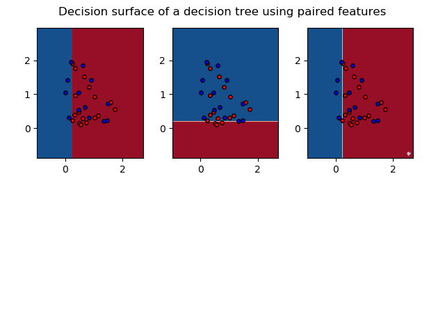
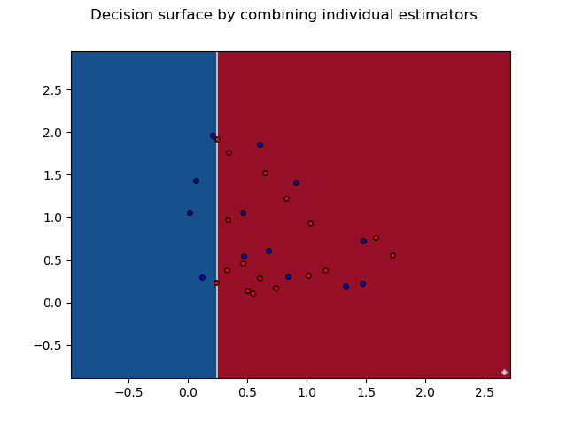
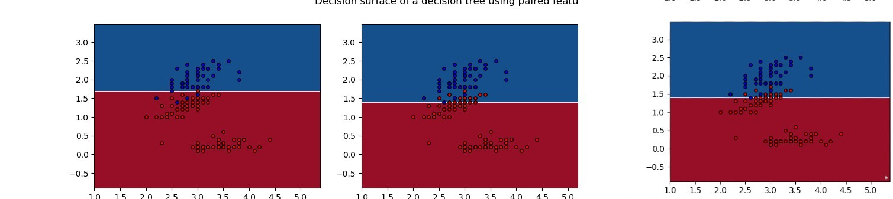
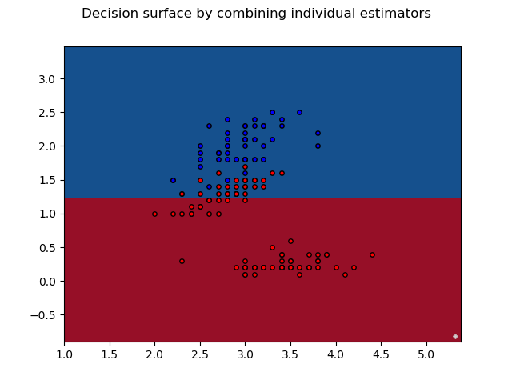

# ES654-2020 Assignment 2

*Harshil Jain* - *17110060*

------

Q.1.a) The results are for a decision stump (max_depth=1)

> The accuracy and precision for the two classes using Adaboost are as follows based on the criteria for information gain:

Criteria : information_gain

Accuracy:  66.66666666666666%

Precision of class 1:  0.64

Recall of class 1:  0.9411764705882353

Precision of class 2:  0.8

Recall of class 2:  0.3076923076923077

> The plots for 3 estimators for Adaboost using the criteria of information gain is:

> The plots for after combining 3 estimators for Adaboost using the criteria of information gain is:

Q.1.b) The results are for a decision stump (max_depth=1)

> The accuracy and precision for the two classes (virginica and non virginica using Adaboost are as follows based on the criteria for information gain:

Accuracy:  96.66666666666667

Precision of class 1:  0.975609756097561

Recall of class 1:  0.975609756097561

Precision of class 2:  0.9473684210526315

Recall of class 2:  0.9473684210526315

> The plots for 3 estimators for Adaboost using the criteria of information gain is:

> The plots for after combining 3 estimators for Adaboost using the criteria of information gain is:

