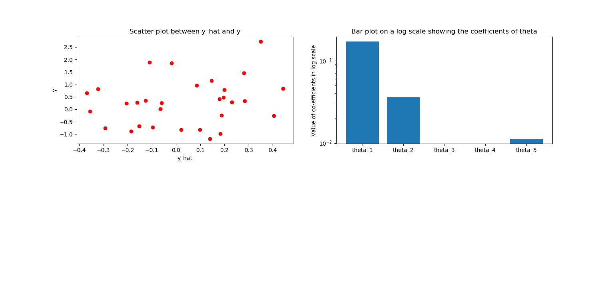

# ES654-2020 Assignment 2

*Harshil Jain - 17110060*

------

Q.2.a) Linear Regression using normal equation with the optional to fit the intercept was implemented:

i) fit_intercept = True

The RMSE and MAE losses are as follows:

RMSE:  0.9044265250464998

MAE:  0.7114318433966357

> Figure 1 and 2 show the scatter plot of ground truth(y) and estimate(yhat) & bar plot on a log scale showing the coefficients of the different features and the intercept term (theta_i) respectively

> The KDE plot of residuals is as follows:

ii) fit_intercept = False

The RMSE and MAE losses are as follows:

RMSE:  0.9452375875781543

MAE:  0.7590075233630846

> Figure 1 and 2 show the scatter plot of ground truth(y) and estimate(yhat) & bar plot on a log scale showing the coefficients of the different features and the intercept term (theta_i) respectively

> The KDE plot of residuals is as follows:

Q.2.b) The theoretical time complexity for the normal equation is O(N^2P + P^3) where N is the number of samples used for training and P is the number of features.

The figure below shows the time complexity where P is fixed to 10 and and N is varied from 30 to 10000.

The time complexity increases as N increases.

> The plot is as follows:

The figure below shows the time complexity where N is fixed to 100 and and P is varied from 50 to 1000.

The time complexity increases and the non linear curve illustrates that it is cubic in nature.

> The plot is as follows:

Q.2.c) 

> Linear Regression on the real estate data where the fit_intercept = True. 5 fold cross validation is used and the MAE and RMSE losses for the 5 folds are as follows:

MAE for Fold 1: 5.520440138277532 and RMSE for Fold 1: 7.249914192591534

MAE for Fold 2: 6.674919698664617 and RMSE for Fold 2: 9.318822756621007

MAE for Fold 3: 5.263831656467129 and RMSE for Fold 3: 7.731585576953605

MAE for Fold 4: 7.392259220026129 and RMSE for Fold 4: 11.620659828023282

MAE for Fold 5: 5.963839689521551 and RMSE for Fold 5: 7.87927419217117

> The plot of learnt co-efficients are as follows:

## Fold 1

## Fold 2

## Fold 3

## Fold 4

## Fold 5

