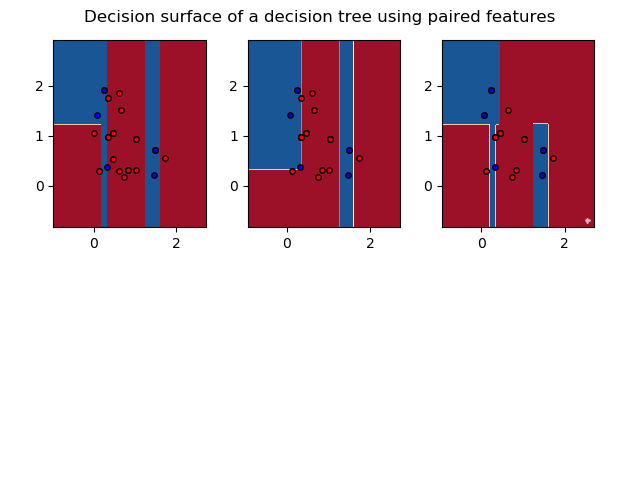
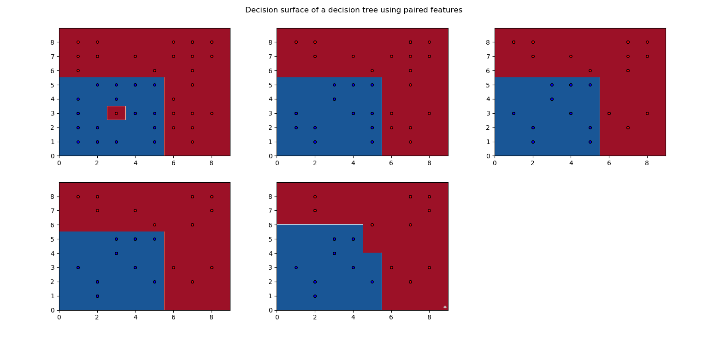
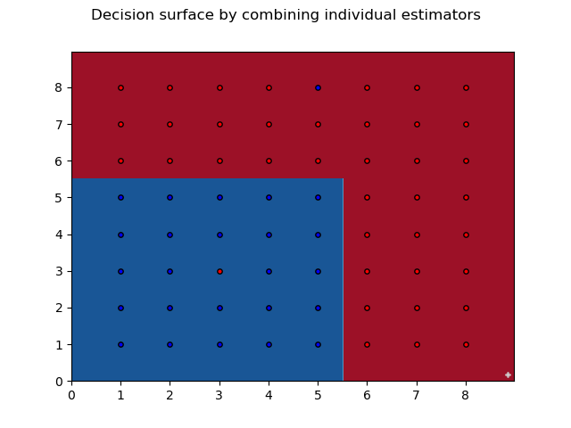

# ES654-2020 Assignment 2

*Harshil Jain* - *17110060*

------

Q.3.a) 

Accuracy:  76.66666666666667%

Precision for class 1:  0.6153846153846154

Recall for class 1:  0.8

Precision for class 2:  0.8823529411764706

Recall for class 2:  0.75

> The plots for 3 estimators using the criteria of information gain is:

> The plots after using Bagging for the 3 estimators:

Q.3.b) 100 points are chosen having integer co-ordinates between 1 to 7 inclusive. 

Accuracy:  71.0%

Precision for class 1:  0.7407407407407407

Recall for class 1:  0.7272727272727273

Precision for class 2:  0.6739130434782609

Recall for class 2:  0.6888888888888889

> The decision boundaries for the 5 estimators are:

> The plots after using Bagging for the 5 estimators:

