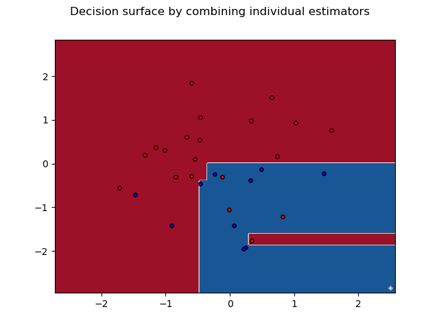

# ES654-2020 Assignment 2

*Harshil Jain* - *17110060*

------

Q.4a. The accuracy and precision for the two classes using Random Forest Classifier are as follows based on the criteria for information gain:

Accuracy:  83.33333333333334%

Precision for class 1:  1.0

Recall for class 1:  0.5

Precision for class 2:  0.8

Recall for class 20:  1.0

> The decision trees for 6 estimators are:

> The plots for 6 estimators for Random Forest Classifier using the criteria of information gain is:

> The plots after combining the 6 estimators is:

The accuracy and precision for the two classes using Random Forest Classifier are as follows based on the criteria of gini index:

Accuracy:  83.33333333333334%

Precision for class 1:  0.6666666666666666

Recall for class 1: 1.0

Precision for class 2:  1.0

Recall for class 20:  0.75

> The decision trees for 6 estimators are:

> The plots for 6 estimators for Random Forest Classifier using the criteria of gini index is:

> The plots after combining the 6 estimators is:

The RMSE and MAE for the two classes using Random Forest Regressor are as follows based on the criteria for information gain:

RMSE:  0.9655326426616659

MAE:  0.6263650419267909

> The decision trees for 6 estimators are:

> The plots for 6 estimators for Random Forest Classifier using the criteria of information gain is:

> The plots after combining the 6 estimators is:

Q.4b. The accuracy and precision for the two classes using Random Forest Classifier are as follows based on the criteria for information gain:

Accuracy:  93.33333333333333

Precision for class 1:  1.0

Recall for class 1:  0.84

Precision for class 2:  1.0

Recall for class 2:  1.0

Precision for class 3:  0.8333333333333334

Recall for class 3:  1.0

> The plots for 6 estimators for Random Forest Classifier using the criteria of information gain is:

> The plots after combining the 6 estimators is:

