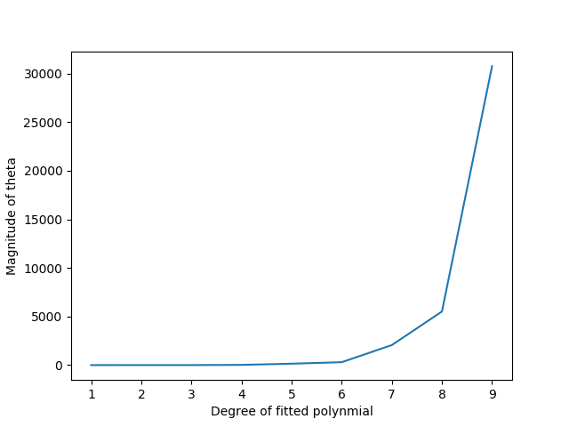

# ES654-2020 Assignment 3

*Harshil Jain* - *17110060*

------

Q.5. The magnitude of theta increases very steeply as the degree of the polynomial fitted rises. This is because as the degree increases, linear regression algorithm tries to fit the data properly (overfitting the datapoints). Hence, the magnitude of the co-efficients rise. This is shown in the figure below:

