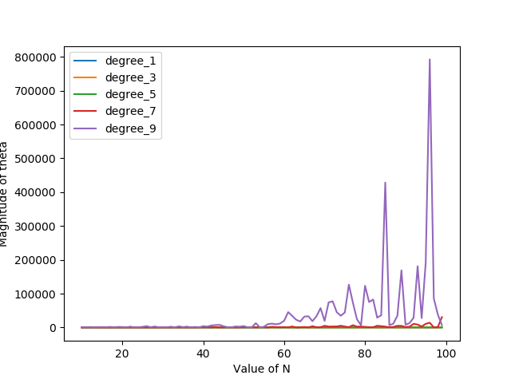

# ES654-2020 Assignment 3

*Harshil Jain* - *17110060*

------

Q.6. The magnitude of theta increases very steeply as the degree of the polynomial fitted rises. However, there is no significant dependence on varying N. As the number of datapoints increases, it overfits the data and hence the magnitude of theta increases, with some spikes in between. This is shown in the figure below: 

