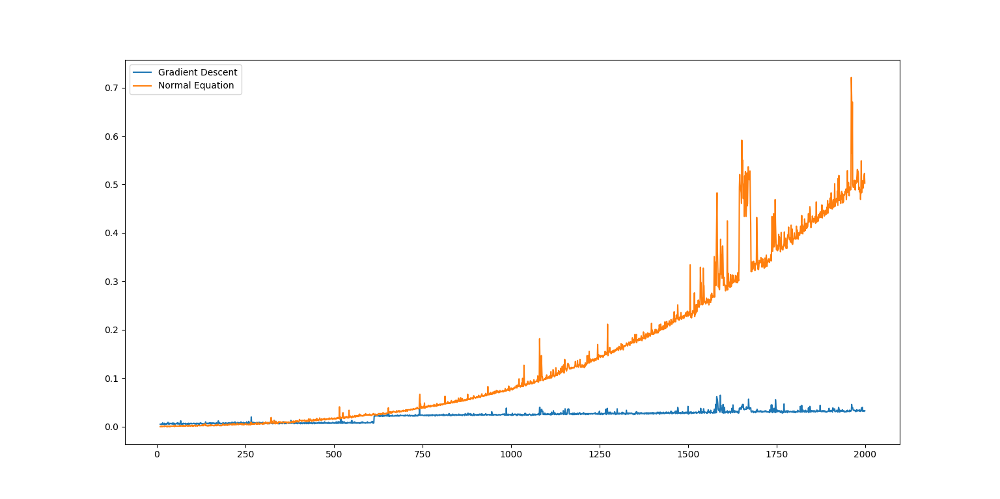
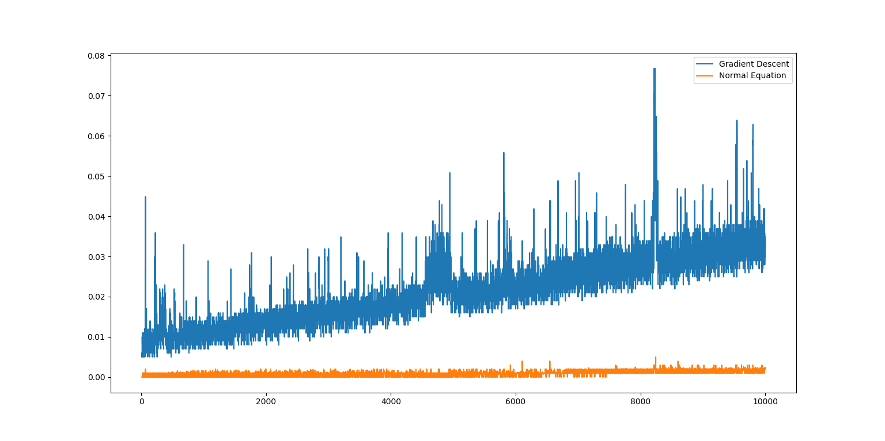

# ES654-2020 Assignment 3

*Harshil Jain* - *17110060*

------

Q.8. The graph of normal equation and gradient descent as P varies is as follows. It shows cubic relation for normal equation with respect to P. For gradient descent, since the number of samples are fixed, the time approximately remains the same.

The graph of normal equation and gradient descent as N varies is as follows. It shows quadratic relation for normal equation with respect to N. The gradient descent time increases because the number of samples increase.

